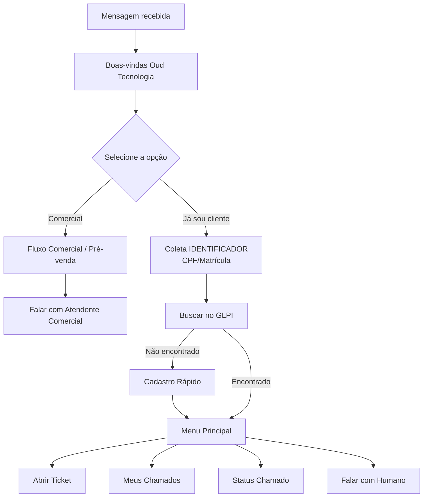

# 🤖 Fluxo do Bot WhatsApp → GLPI — Design Completo

> Este documento descreve o fluxo lógico completo do bot de atendimento via WhatsApp
> integrado ao GLPI. Use como referência para montar o fluxo no Typebot.

---

## 1. Visão Geral do Fluxo



---

## 2. Fluxo Detalhado — Passo a Passo

### ETAPA 0 — Saudação Inicial (Triagem)

```
BOT: "Olá! 👋 Somos da Oud Tecnologia.
      Selecione uma das opções abaixo para continuarmos:"

BOTÕES:
[ Já sou cliente ]  → Ir para ETAPA 1
[ Comercial ]       → Ir para FLUXO COMERCIAL
```

---

### ETAPA 1 — Boas-Vindas (Identificação Cliente)

```
BOT: "Excelente! Para agilizarmos seu atendimento, preciso te identificar.
      Por favor, informe seu CPF ou matrícula:"

USUÁRIO: digita CPF ou matrícula → salvar em {{identificador}}
```

**Validação do input:**
- Remover pontos, traços e espaços
- Verificar se é numérico
- Se CPF: validar dígitos (11 caracteres)
- Se matrícula: aceitar formato da empresa

```
Se inválido:
BOT: "❌ Formato inválido. Por favor, informe apenas os números do CPF (11 dígitos)
      ou número de matrícula.
      Exemplo: 12345678901"
→ repetir pergunta (máx 3 tentativas)
→ após 3 falhas: "Por favor, entre em contato com o setor de TI diretamente."
```

---

### ETAPA 2 — Buscar Usuário no GLPI

**HTTP Request no Typebot:**

```
URL:     http://glpi-proxy:3003/user/search
Método:  POST
Headers:
  Content-Type: application/json
  x-proxy-key: {{proxy_secret}}
Body:
{
  "identificador": "{{identificador}}"
}
Salvar em: {{usuario_glpi}}
```

**Decisão:**

```
Se usuario_glpi.found == true:
  → Salvar {{user_id}}, {{user_name}}, {{user_email}}
  → BOT: "✅ Encontrei! Olá, {{user_name}}! Como posso ajudar?"
  → Ir para MENU PRINCIPAL

Se usuario_glpi.found == false:
  → BOT: "Não encontrei seu cadastro no sistema. Vamos fazer um cadastro rápido?"
  → Ir para CADASTRO RÁPIDO
```

---

### ETAPA 3a — Cadastro Rápido (se não encontrado)

```
BOT: "📝 Vamos ao cadastro rápido. Qual seu nome completo?"
USUÁRIO: → salvar em {{nome_completo}}

BOT: "Qual seu email corporativo?"
USUÁRIO: → salvar em {{email}}
  Validar: contém @ e domínio válido
  Se inválido: "❌ Email inválido. Informe um email válido (ex: nome@empresa.com)"

BOT: "Qual seu setor/departamento?"
USUÁRIO: Botões com opções pré-definidas (baseados nos Grupos do GLPI)
  [ TI ]  [ Financeiro ]  [ RH ]  [ Operacional ]  [ Administrativo ]  [ Outro ]
  → salvar em {{setor}}

BOT: "Qual seu ramal/telefone de contato? (opcional — digite 0 para pular)"
USUÁRIO: → salvar em {{telefone_contato}}
```

**HTTP Request — Criar usuário no GLPI:**

```
URL:     http://glpi-proxy:3003/user/create
Método:  POST
Headers:
  Content-Type: application/json
  x-proxy-key: {{proxy_secret}}
Body:
{
  "nome": "{{nome_completo}}",
  "email": "{{email}}",
  "telefone": "{{telefone_contato}}",
  "setor": "{{setor}}",
  "identificador": "{{identificador}}"
}
Salvar em: {{novo_usuario}}
```

```
Se sucesso:
  → Salvar {{user_id}} do retorno
  → BOT: "✅ Cadastro realizado! Agora você pode usar todos os serviços."
  → Ir para MENU PRINCIPAL

Se erro:
  → BOT: "❌ Não consegui fazer seu cadastro automaticamente.
          Por favor, entre em contato com o TI pelo ramal XXXX
          ou email ti@empresa.com para liberação de acesso."
  → Encerrar fluxo
```

---

### ETAPA 3b — Menu Principal

```
BOT: "Como posso ajudar?

      1️⃣ 📝 Abrir um chamado
      2️⃣ 📋 Ver meus chamados
      3️⃣ 🔍 Consultar status de um chamado
      4️⃣ 💬 Falar com um atendente
      5️⃣ ❌ Encerrar"

USUÁRIO: escolhe opção → salvar em {{opcao_menu}}
```

---

### OPÇÃO 1 — Abrir Chamado

#### 1.1 — Tipo do chamado

```
BOT: "Qual o tipo do atendimento?

      🔧 Incidente — Algo parou de funcionar
      📋 Solicitação — Preciso de algo novo"

USUÁRIO: escolhe → salvar em {{tipo_chamado}}
  Incidente = 1
  Solicitação = 2
```

#### 1.2 — Categoria (baseada nos ITILCategories do GLPI)

```
BOT: "Qual a área do seu problema?"

Se Incidente:
  [ 🖥️ Computador/Notebook ]    categoria_id = X
  [ 🖨️ Impressora ]              categoria_id = Y
  [ 🌐 Internet/Rede ]           categoria_id = Z
  [ 📧 Email ]                   categoria_id = W
  [ 📱 Sistema/Software ]        categoria_id = V
  [ 🔐 Acesso/Permissão ]        categoria_id = U
  [ ❓ Outro ]                   categoria_id = 0

Se Solicitação:
  [ 👤 Novo usuário ]            categoria_id = A
  [ 💻 Novo equipamento ]        categoria_id = B
  [ 🔑 Reset de senha ]          categoria_id = C
  [ 📦 Instalação de software ]  categoria_id = D
  [ ❓ Outro ]                   categoria_id = 0

USUÁRIO: escolhe → salvar em {{categoria_id}}
```

> **NOTA:** Os IDs de categoria devem corresponder aos cadastrados no GLPI.
> Para obter a lista: `GET /apirest.php/ITILCategory` ou ver em
> `Configurar → Dropdowns → Categorias ITIL` no painel do GLPI.

#### 1.3 — Urgência

```
BOT: "Qual a urgência?

      🔴 Alta — Serviço crítico parado, vários afetados
      🟡 Média — Atrapalha o trabalho mas consigo contornar
      🟢 Baixa — Não é urgente"

USUÁRIO: escolhe → salvar em {{urgencia}}
  Alta = 2
  Média = 3
  Baixa = 4
```

#### 1.4 — Título e Descrição

```
BOT: "Descreva o problema em uma frase curta (será o título do chamado):"
USUÁRIO: → salvar em {{titulo_chamado}}
  Validar: mínimo 5 caracteres
  Se muito curto: "❌ Por favor, descreva melhor. Ex: 'Impressora do 2º andar não imprime'"

BOT: "Agora descreva com mais detalhes o que está acontecendo.
      Quanto mais informação, mais rápido resolvemos!

      Inclua:
      • O que estava fazendo quando o problema ocorreu
      • Mensagem de erro (se houver)
      • Desde quando está acontecendo"
USUÁRIO: → salvar em {{descricao_chamado}}
  Validar: mínimo 10 caracteres
```

#### 1.5 — Confirmação

```
BOT: "📋 Resumo do chamado:

      📌 Tipo: {{tipo_chamado == 1 ? 'Incidente' : 'Solicitação'}}
      📁 Categoria: {{nome_categoria}}
      🔔 Urgência: {{nome_urgencia}}
      📝 Título: {{titulo_chamado}}
      📄 Descrição: {{descricao_chamado}}

      ✅ Confirmar abertura?
      ❌ Cancelar"

USUÁRIO: escolhe
```

#### 1.6 — Criar Ticket no GLPI

**Se confirmou:**

```
URL:     http://glpi-proxy:3003/ticket
Método:  POST
Headers:
  Content-Type: application/json
  x-proxy-key: {{proxy_secret}}
Body:
{
  "nome": "{{titulo_chamado}}",
  "descricao": "{{descricao_chamado}}",
  "tipo": {{tipo_chamado}},
  "urgencia": {{urgencia}},
  "categoria_id": {{categoria_id}},
  "user_id": {{user_id}},
  "telefone": "{{telefone_whatsapp}}"
}
Salvar em: {{resposta_ticket}}
```

```
Se sucesso:
  BOT: "✅ Chamado #{{resposta_ticket.ticket_id}} aberto com sucesso!

        Você será notificado quando houver atualizações.
        Para acompanhar: acesse o GLPI ou envie qualquer mensagem
        e escolha 'Consultar chamado'.

        Deseja fazer mais alguma coisa?"
  → Botões: [ Menu Principal ] [ Encerrar ]

Se erro (queued = true):
  BOT: "⚠️ O sistema está temporariamente indisponível, mas seu
        chamado foi salvo e será criado automaticamente em breve.
        Você receberá uma confirmação assim que for processado.

        Deseja fazer mais alguma coisa?"
  → Botões: [ Menu Principal ] [ Encerrar ]

Se erro (queued = false):
  BOT: "❌ Ocorreu um erro ao abrir o chamado. Por favor, tente
        novamente em alguns minutos ou entre em contato com o TI
        pelo ramal XXXX."
  → Botões: [ Tentar Novamente ] [ Menu Principal ] [ Encerrar ]
```

---

### OPÇÃO 2 — Ver Meus Chamados

```
URL:     http://glpi-proxy:3003/user/{{user_id}}/tickets
Método:  GET
Headers:
  x-proxy-key: {{proxy_secret}}
Salvar em: {{meus_tickets}}
```

```
Se tem tickets:
  BOT: "📋 Seus chamados recentes:

        🎫 #{{t1.id}} — {{t1.name}}
           Status: {{t1.status_name}} | {{t1.date}}

        🎫 #{{t2.id}} — {{t2.name}}
           Status: {{t2.status_name}} | {{t2.date}}

        🎫 #{{t3.id}} — {{t3.name}}
           Status: {{t3.status_name}} | {{t3.date}}

        (Mostrando os 5 mais recentes)

        Deseja ver detalhes de algum? Informe o número."

Se não tem tickets:
  BOT: "📭 Você não possui chamados abertos no momento.
        Deseja abrir um novo?"
  → Botões: [ Abrir Chamado ] [ Menu Principal ]
```

**Status do GLPI mapeados:**
| Código | Nome | Emoji |
|---|---|---|
| 1 | Novo | 🆕 |
| 2 | Em atendimento (atribuído) | 🔄 |
| 3 | Em atendimento (planejado) | 📅 |
| 4 | Pendente | ⏸️ |
| 5 | Solucionado | ✅ |
| 6 | Fechado | 🔒 |

---

### OPÇÃO 3 — Consultar Status de um Chamado

```
BOT: "Informe o número do chamado (ex: 123):"
USUÁRIO: → salvar em {{ticket_id_consulta}}
  Validar: numérico
```

```
URL:     http://glpi-proxy:3003/ticket/{{ticket_id_consulta}}
Método:  GET
Headers:
  x-proxy-key: {{proxy_secret}}
Salvar em: {{ticket_info}}
```

```
Se encontrado:
  BOT: "🎫 Chamado #{{ticket_info.ticket.id}}

        📌 Título: {{ticket_info.ticket.name}}
        📊 Status: {{status_emoji}} {{status_name}}
        🔔 Urgência: {{urgencia_name}}
        📅 Aberto em: {{ticket_info.ticket.date}}

        Deseja fazer mais alguma coisa?"
  → Botões: [ Menu Principal ] [ Encerrar ]

Se não encontrado:
  BOT: "❌ Chamado #{{ticket_id_consulta}} não encontrado.
        Verifique o número e tente novamente."
  → Botões: [ Tentar Novamente ] [ Menu Principal ]
```

---

### FLUXO COMERCIAL — Pré-venda (Lead)

```
BOT: "Legal! Que bom seu interesse na Oud Tecnologia. 🚀
      Para que um de nossos consultores possa te atender da melhor forma,
      preciso de apenas 3 informações rápidas:

      Qual seu nome?"
USUÁRIO: → {{nome_lead}}

BOT: "E qual o nome da sua empresa?"
USUÁRIO: → {{empresa_lead}}

BOT: "Perfeito, {{nome_lead}} da {{empresa_lead}}. Qual serviço você busca?
      (Clique em uma das opções abaixo)"

BOTÕES:
[ Suporte/Consultoria GLPI ]
[ Cloud/Infraestrutura ]
[ Desenvolvimento Sob Medida ]
[ Outros ]
USUÁRIO: → {{interesse_lead}}

BOT: "Obrigado! Já passei seus dados para o comercial.
      Um de nossos consultores falará com você neste número em instantes. 🕒"

NOTIFICAÇÃO (via Webhook):
Enviar dados para grupo de WhatsApp do Comercial ou CRM.
```

---

### OPÇÃO 4 (MENU) — Falar com Atendente (Suporte)

```
BOT: "Vou encaminhar você para um analista de suporte.
      Por favor, descreva brevemente o motivo do contato:"
USUÁRIO: → salvar em {{motivo_suporte}}

BOT: "✅ Solicitação registrada. Um analista entrará em contato em breve.
      Protocolo de identificação: {{user_id}}.

      Horário de atendimento: Seg-Sex, 08h às 18h.
      Fora do horário, utilize a opção 'Abrir Chamado' pelo bot."

NOTIFICAÇÃO (via Webhook):
Enviar dados para o grupo de Suporte/TI com link para o usuário no WhatsApp.
```

---

### OPÇÃO 5 — Encerrar

```
BOT: "Obrigado por usar o atendimento de TI! 👋
      Se precisar de algo, é só mandar uma mensagem.
      Até mais!"
→ Encerrar fluxo
```

---

## 3. Endpoints Necessários no GLPI Proxy

O `server.js` precisa dos seguintes endpoints para suportar o fluxo completo:

| Método | Endpoint | Função |
|---|---|---|
| `POST` | `/ticket` | Criar chamado ✅ (já existe) |
| `GET` | `/ticket/:id` | Consultar chamado ✅ (já existe) |
| `POST` | `/user/search` | Buscar usuário por CPF/matrícula 🆕 |
| `POST` | `/user/create` | Criar usuário no GLPI 🆕 |
| `GET` | `/user/:id/tickets` | Listar tickets do usuário 🆕 |
| `GET` | `/health` | Health check ✅ (já existe) |

---

## 4. Tratamento de Erros — Resumo

| Situação | Comportamento do Bot |
|---|---|
| CPF/matrícula inválido | Pede novamente, máx 3x, depois encerra |
| Usuário não encontrado no GLPI | Oferece cadastro rápido |
| Cadastro falha | Direciona para contato humano |
| GLPI fora do ar ao criar ticket | Ticket entra na fila de retry, usuário é avisado |
| GLPI fora do ar ao consultar | Mensagem de indisponibilidade + sugestão de tentar depois |
| Ticket não encontrado | Informa e pede para verificar número |
| Timeout do fluxo (30 min sem resposta) | Fluxo morre, próxima mensagem reinicia |
| Input inesperado em qualquer etapa | "Não entendi" + repetir a pergunta |
| Erro desconhecido (500) | Mensagem genérica + sugestão de contato humano |

---

## 5. Variáveis do Typebot — Referência

| Variável | Tipo | Onde é definida |
|---|---|---|
| `{{identificador}}` | string | Input do usuário (CPF/matrícula) |
| `{{usuario_glpi}}` | object | Resposta de `/user/search` |
| `{{user_id}}` | number | Extraído de `usuario_glpi` ou `novo_usuario` |
| `{{user_name}}` | string | Extraído de `usuario_glpi` |
| `{{nome_completo}}` | string | Input do usuário (cadastro) |
| `{{email}}` | string | Input do usuário (cadastro) |
| `{{setor}}` | string | Escolha do usuário (cadastro) |
| `{{telefone_contato}}` | string | Input do usuário (cadastro) |
| `{{tipo_chamado}}` | number | 1=Incidente, 2=Solicitação |
| `{{categoria_id}}` | number | ID da categoria ITIL no GLPI |
| `{{urgencia}}` | number | 2=Alta, 3=Média, 4=Baixa |
| `{{titulo_chamado}}` | string | Input do usuário |
| `{{descricao_chamado}}` | string | Input do usuário |
| `{{resposta_ticket}}` | object | Resposta de `/ticket` |
| `{{meus_tickets}}` | array | Resposta de `/user/:id/tickets` |
| `{{ticket_info}}` | object | Resposta de `/ticket/:id` |
| `{{proxy_secret}}` | string | Configurar como variável oculta no Typebot |
