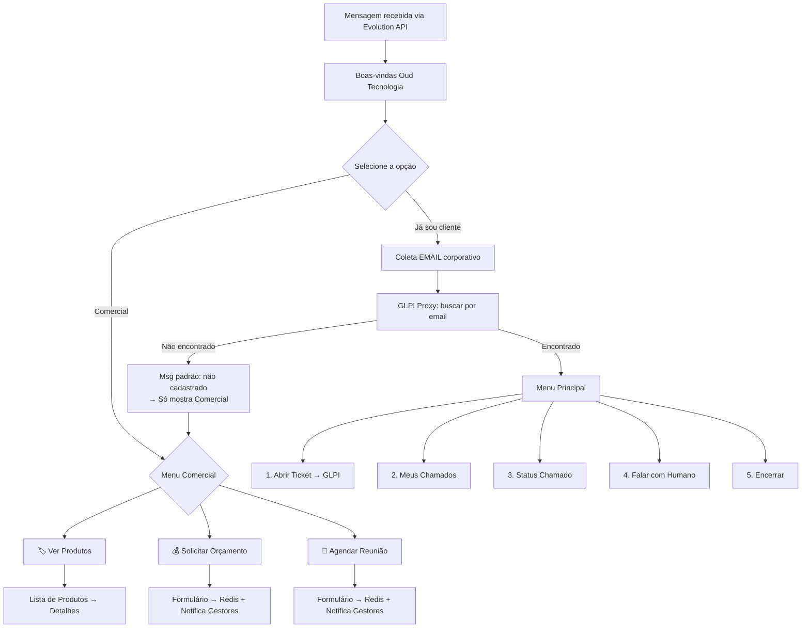

# 🤖 Fluxo do Bot WhatsApp → GLPI — Design Completo

> Este documento descreve o fluxo lógico completo do bot de atendimento via WhatsApp
> (Evolution API) integrado ao GLPI. Use como referência para montar o fluxo no Typebot.
> Última atualização: 11/03/2026

---

## 1. Visão Geral do Fluxo



**Caminho dos dados:**
```
WhatsApp → Evolution API (VPS:8080) → Typebot Viewer (VPS:3002) → GLPI Proxy (VPS:3003) → GLPI API (localhost)
```

**Regra fundamental:**
- **Pessoa cadastrada no GLPI** → Acesso completo (Menu Principal + Comercial)
- **Pessoa NÃO cadastrada** → Apenas Comercial (sem abrir chamados)

---

## 2. Fluxo Detalhado — Passo a Passo

### ETAPA 0 — Saudação Inicial (Triagem)

```
BOT: "Olá! 👋 Somos da Oud Tecnologia.
      Selecione uma das opções abaixo para continuarmos:"

BOTÕES:
[ Já sou cliente ]  → Ir para ETAPA 1
[ Comercial ]       → Ir para FLUXO COMERCIAL
```

---

### ETAPA 1 — Identificação do Cliente (por Email)

```
BOT: "Excelente! Para agilizarmos seu atendimento, preciso te identificar.
      Por favor, informe seu email corporativo cadastrado:"

USUÁRIO: digita email → salvar em {{email_identificacao}}
```

**Validação do input:**
- Verificar se contém `@` e domínio válido
- Converter para minúsculo

```
Se inválido:
BOT: "❌ Email inválido. Por favor, informe um email válido.
      Exemplo: nome@empresa.com"
→ repetir pergunta (máx 3 tentativas)
→ após 3 falhas: "Por favor, entre em contato com o gestor do seu projeto."
```

---

### ETAPA 2 — Buscar Usuário no GLPI

**HTTP Request no Typebot:**

```
URL:     http://glpi-proxy:3003/user/search
Método:  POST
Headers:
  Content-Type: application/json
  x-proxy-key: {{proxy_secret}}
Body:
{
  "email": "{{email_identificacao}}"
}
Salvar em: {{usuario_glpi}}
```

**Decisão:**

```
Se usuario_glpi.found == true:
  → Salvar {{user_id}}, {{user_name}}, {{user_email}}
  → BOT: "✅ Encontrei! Olá, {{user_name}}! Como posso ajudar?"
  → Ir para MENU PRINCIPAL

Se usuario_glpi.found == false:
  → Ir para MENSAGEM PADRÃO (não cadastrado)
```

---

### ETAPA 3 — Mensagem Padrão (Não Cadastrado)

> **IMPORTANTE:** Pessoas não cadastradas NÃO podem abrir chamados.
> A única opção disponível é o fluxo Comercial.

```
BOT: "❌ Não encontramos seu cadastro em nossa base.

      Caso você seja integrante de alguma empresa cliente da Oud Tecnologia,
      por favor contate o gestor do seu projeto para que ele solicite
      seu cadastro no sistema.

      Enquanto isso, posso te ajudar com informações comerciais! 😊"

BOTÕES:
[ Ver nossos produtos ]         → FLUXO COMERCIAL > Produtos
[ Solicitar orçamento ]         → FLUXO COMERCIAL > Orçamento
[ Agendar uma reunião ]         → FLUXO COMERCIAL > Reunião
[ Encerrar ]                    → ENCERRAR
```

---

### ETAPA 4 — Menu Principal (somente clientes cadastrados)

```
BOT: "Como posso ajudar?

      1️⃣ 📝 Abrir um chamado
      2️⃣ 📋 Ver meus chamados
      3️⃣ 🔍 Consultar status de um chamado
      4️⃣ 💬 Falar com um atendente
      5️⃣ 🏷️ Área comercial
      6️⃣ ❌ Encerrar"

USUÁRIO: escolhe opção → salvar em {{opcao_menu}}
```

> **Nota:** Clientes cadastrados também podem acessar o menu comercial (opção 5).

---

### OPÇÃO 1 — Abrir Chamado

#### 1.1 — Tipo do chamado

```
BOT: "Qual o tipo do atendimento?

      🔧 Incidente — Algo parou de funcionar
      📋 Solicitação — Preciso de algo novo"

USUÁRIO: escolhe → salvar em {{tipo_chamado}}
  Incidente = 1
  Solicitação = 2
```

#### 1.2 — Categoria (baseada nos ITILCategories do GLPI)

```
BOT: "Qual a área do seu problema?"

Se Incidente:
  [ 🖥️ Computador/Notebook ]    categoria_id = X
  [ 🖨️ Impressora ]              categoria_id = Y
  [ 🌐 Internet/Rede ]           categoria_id = Z
  [ 📧 Email ]                   categoria_id = W
  [ 📱 Sistema/Software ]        categoria_id = V
  [ 🔐 Acesso/Permissão ]        categoria_id = U
  [ ❓ Outro ]                   categoria_id = 0

Se Solicitação:
  [ 👤 Novo usuário ]            categoria_id = A
  [ 💻 Novo equipamento ]        categoria_id = B
  [ 🔑 Reset de senha ]          categoria_id = C
  [ 📦 Instalação de software ]  categoria_id = D
  [ ❓ Outro ]                   categoria_id = 0

USUÁRIO: escolhe → salvar em {{categoria_id}}
```

> **NOTA:** Os IDs de categoria devem corresponder aos cadastrados no GLPI.
> Para obter a lista: `GET /apirest.php/ITILCategory` ou ver em
> `Configurar → Dropdowns → Categorias ITIL` no painel do GLPI.

#### 1.3 — Urgência

```
BOT: "Qual a urgência?

      🔴 Alta — Serviço crítico parado, vários afetados
      🟡 Média — Atrapalha o trabalho mas consigo contornar
      🟢 Baixa — Não é urgente"

USUÁRIO: escolhe → salvar em {{urgencia}}
  Alta = 2
  Média = 3
  Baixa = 4
```

#### 1.4 — Título e Descrição

```
BOT: "Descreva o problema em uma frase curta (será o título do chamado):"
USUÁRIO: → salvar em {{titulo_chamado}}
  Validar: mínimo 5 caracteres
  Se muito curto: "❌ Por favor, descreva melhor. Ex: 'Impressora do 2º andar não imprime'"

BOT: "Agora descreva com mais detalhes o que está acontecendo.
      Quanto mais informação, mais rápido resolvemos!

      Inclua:
      • O que estava fazendo quando o problema ocorreu
      • Mensagem de erro (se houver)
      • Desde quando está acontecendo"
USUÁRIO: → salvar em {{descricao_chamado}}
  Validar: mínimo 10 caracteres
```

#### 1.5 — Confirmação

```
BOT: "📋 Resumo do chamado:

      📌 Tipo: {{tipo_chamado == 1 ? 'Incidente' : 'Solicitação'}}
      📁 Categoria: {{nome_categoria}}
      🔔 Urgência: {{nome_urgencia}}
      📝 Título: {{titulo_chamado}}
      📄 Descrição: {{descricao_chamado}}

      ✅ Confirmar abertura?
      ❌ Cancelar"

USUÁRIO: escolhe
```

#### 1.6 — Criar Ticket no GLPI

**Se confirmou:**

```
URL:     http://glpi-proxy:3003/ticket
Método:  POST
Headers:
  Content-Type: application/json
  x-proxy-key: {{proxy_secret}}
Body:
{
  "nome": "{{titulo_chamado}}",
  "descricao": "{{descricao_chamado}}",
  "tipo": {{tipo_chamado}},
  "urgencia": {{urgencia}},
  "categoria_id": {{categoria_id}},
  "user_id": {{user_id}},
  "telefone": "{{telefone_whatsapp}}"
}
Salvar em: {{resposta_ticket}}
```

```
Se sucesso:
  BOT: "✅ Chamado #{{resposta_ticket.ticket_id}} aberto com sucesso!

        Você será notificado quando houver atualizações.
        Para acompanhar: acesse o GLPI ou envie qualquer mensagem
        e escolha 'Consultar chamado'.

        Deseja fazer mais alguma coisa?"
  → Botões: [ Menu Principal ] [ Encerrar ]

Se erro (queued = true):
  BOT: "⚠️ O sistema está temporariamente indisponível, mas seu
        chamado foi salvo e será criado automaticamente em breve.
        Você receberá uma confirmação assim que for processado.

        Deseja fazer mais alguma coisa?"
  → Botões: [ Menu Principal ] [ Encerrar ]

Se erro (queued = false):
  BOT: "❌ Ocorreu um erro ao abrir o chamado. Por favor, tente
        novamente em alguns minutos ou entre em contato com o TI
        pelo ramal XXXX."
  → Botões: [ Tentar Novamente ] [ Menu Principal ] [ Encerrar ]
```

**Resiliência:** Se GLPI não responde, o proxy salva no Redis e tenta recriar a cada 1 min.
Após 5 falhas → Dead Letter Queue (recuperação manual pelo admin).

---

### OPÇÃO 2 — Ver Meus Chamados

```
URL:     http://glpi-proxy:3003/user/{{user_id}}/tickets
Método:  GET
Headers:
  x-proxy-key: {{proxy_secret}}
Salvar em: {{meus_tickets}}
```

```
Se tem tickets:
  BOT: "📋 Seus chamados recentes:

        🎫 #{{t1.id}} — {{t1.name}}
           Status: {{t1.status_name}} | {{t1.date}}

        🎫 #{{t2.id}} — {{t2.name}}
           Status: {{t2.status_name}} | {{t2.date}}

        🎫 #{{t3.id}} — {{t3.name}}
           Status: {{t3.status_name}} | {{t3.date}}

        (Mostrando os 5 mais recentes)

        Deseja ver detalhes de algum? Informe o número."

Se não tem tickets:
  BOT: "📭 Você não possui chamados abertos no momento.
        Deseja abrir um novo?"
  → Botões: [ Abrir Chamado ] [ Menu Principal ]
```

**Status do GLPI mapeados:**
| Código | Nome | Emoji |
|---|---|---|
| 1 | Novo | 🆕 |
| 2 | Em atendimento (atribuído) | 🔄 |
| 3 | Em atendimento (planejado) | 📅 |
| 4 | Pendente | ⏸️ |
| 5 | Solucionado | ✅ |
| 6 | Fechado | 🔒 |

---

### OPÇÃO 3 — Consultar Status de um Chamado

```
BOT: "Informe o número do chamado (ex: 123):"
USUÁRIO: → salvar em {{ticket_id_consulta}}
  Validar: numérico
```

```
URL:     http://glpi-proxy:3003/ticket/{{ticket_id_consulta}}
Método:  GET
Headers:
  x-proxy-key: {{proxy_secret}}
Salvar em: {{ticket_info}}
```

```
Se encontrado:
  BOT: "🎫 Chamado #{{ticket_info.ticket.id}}

        📌 Título: {{ticket_info.ticket.name}}
        📊 Status: {{status_emoji}} {{status_name}}
        🔔 Urgência: {{urgencia_name}}
        📅 Aberto em: {{ticket_info.ticket.date}}

        Deseja fazer mais alguma coisa?"
  → Botões: [ Menu Principal ] [ Encerrar ]

Se não encontrado:
  BOT: "❌ Chamado #{{ticket_id_consulta}} não encontrado.
        Verifique o número e tente novamente."
  → Botões: [ Tentar Novamente ] [ Menu Principal ]
```

---

### FLUXO COMERCIAL — 3 Opções

> Acessível por **qualquer pessoa** (cadastrada ou não).

```
BOT: "🚀 Área Comercial da Oud Tecnologia!
      Como posso te ajudar?"

BOTÕES:
[ 🏷️ Ver nossos produtos ]       → PRODUTOS
[ 💰 Solicitar orçamento ]        → ORÇAMENTO
[ 📅 Agendar uma reunião ]        → REUNIÃO
[ ↩️ Voltar ]                     → Menu anterior
```

---

#### COMERCIAL > Opção 1 — Ver Produtos

```
BOT: "Conheça nossos serviços! Escolha para saber mais:"

BOTÕES:
[ 🖥️ Suporte e Consultoria GLPI ]
[ ☁️ Cloud e Infraestrutura ]
[ 💻 Desenvolvimento Sob Medida ]
[ 📊 Monitoramento e NOC ]
[ 🔐 Segurança da Informação ]
[ ↩️ Voltar ao menu comercial ]

USUÁRIO: escolhe → {{produto_selecionado}}
```

**Exemplo de detalhe de produto (exibido ao clicar):**

```
Se "Suporte e Consultoria GLPI":
  BOT: "🖥️ *Suporte e Consultoria GLPI*

        Oferecemos implantação, customização e suporte técnico
        especializado para o GLPI.

        ✅ Implantação e configuração completa
        ✅ Treinamento para equipe
        ✅ Suporte contínuo (SLA definido)
        ✅ Integrações e plugins personalizados

        Deseja saber mais?"
  → Botões: [ Solicitar Orçamento ] [ Ver outros produtos ] [ Voltar ]
```

> Repetir mesma estrutura para cada produto (Cloud, Desenvolvimento, NOC, Segurança).

---

#### COMERCIAL > Opção 2 — Solicitar Orçamento

> Formulário salvo no Redis + notificação automática para gestores via WhatsApp.

```
BOT: "💰 Vamos montar um orçamento para você!
      Preciso de algumas informações:"

BOT: "Qual seu nome completo?"
USUÁRIO: → {{lead_nome}}

BOT: "Qual o nome da sua empresa?"
USUÁRIO: → {{lead_empresa}}

BOT: "Qual seu email para contato?"
USUÁRIO: → {{lead_email}}
  Validar: contém @ e domínio válido

BOT: "Qual seu telefone? (com DDD)"
USUÁRIO: → {{lead_telefone}}

BOT: "Qual serviço você tem interesse?"
BOTÕES:
  [ Suporte/Consultoria GLPI ]
  [ Cloud/Infraestrutura ]
  [ Desenvolvimento Sob Medida ]
  [ Monitoramento/NOC ]
  [ Segurança ]
  [ Outro ]
USUÁRIO: → {{lead_servico}}

BOT: "Quer acrescentar algum detalhe ou observação?
      (digite 'não' para pular)"
USUÁRIO: → {{lead_detalhes}}
```

**Confirmação + HTTP Request:**

```
BOT: "📋 Resumo do seu pedido de orçamento:

      👤 Nome: {{lead_nome}}
      🏢 Empresa: {{lead_empresa}}
      📧 Email: {{lead_email}}
      📱 Telefone: {{lead_telefone}}
      🏷️ Serviço: {{lead_servico}}
      📝 Detalhes: {{lead_detalhes}}

      ✅ Confirmar envio?"

Se confirmou:
  URL:     http://glpi-proxy:3003/comercial/lead
  Método:  POST
  Headers:
    Content-Type: application/json
    x-proxy-key: {{proxy_secret}}
  Body:
  {
    "tipo": "orcamento",
    "nome": "{{lead_nome}}",
    "empresa": "{{lead_empresa}}",
    "email": "{{lead_email}}",
    "telefone": "{{lead_telefone}}",
    "detalhes": "Serviço: {{lead_servico}}. {{lead_detalhes}}"
  }

  BOT: "✅ Pedido de orçamento enviado com sucesso!
        Um de nossos consultores entrará em contato em breve. 🚀"
```

> **Backend:** O proxy salva o lead no Redis (`comercial:leads`) e
> envia WhatsApp para os gestores via Evolution API automaticamente.

---

#### COMERCIAL > Opção 3 — Agendar Reunião

> Formulário salvo no Redis + notificação automática para gestores via WhatsApp.

```
BOT: "📅 Vamos agendar uma reunião!
      Preciso de algumas informações:"

BOT: "Qual seu nome completo?"
USUÁRIO: → {{reun_nome}}

BOT: "Qual o nome da sua empresa?"
USUÁRIO: → {{reun_empresa}}

BOT: "Qual seu email para contato?"
USUÁRIO: → {{reun_email}}
  Validar: contém @ e domínio válido

BOT: "Qual seu telefone? (com DDD)"
USUÁRIO: → {{reun_telefone}}

BOT: "Qual data preferencial para a reunião?"
BOTÕES:
  [ Esta semana ]
  [ Próxima semana ]
  [ Sem preferência ]
USUÁRIO: → {{reun_data}}

BOT: "Qual horário prefere?"
BOTÕES:
  [ Manhã (8h-12h) ]
  [ Tarde (13h-18h) ]
  [ Sem preferência ]
USUÁRIO: → {{reun_horario}}

BOT: "Qual o assunto da reunião?"
USUÁRIO: → {{reun_assunto}}
```

**Confirmação + HTTP Request:**

```
BOT: "📋 Resumo do agendamento:

      👤 Nome: {{reun_nome}}
      🏢 Empresa: {{reun_empresa}}
      📧 Email: {{reun_email}}
      📱 Telefone: {{reun_telefone}}
      📅 Data: {{reun_data}}
      🕐 Horário: {{reun_horario}}
      📝 Assunto: {{reun_assunto}}

      ✅ Confirmar agendamento?"

Se confirmou:
  URL:     http://glpi-proxy:3003/comercial/lead
  Método:  POST
  Headers:
    Content-Type: application/json
    x-proxy-key: {{proxy_secret}}
  Body:
  {
    "tipo": "reuniao",
    "nome": "{{reun_nome}}",
    "empresa": "{{reun_empresa}}",
    "email": "{{reun_email}}",
    "telefone": "{{reun_telefone}}",
    "data_preferencial": "{{reun_data}}",
    "horario_preferencial": "{{reun_horario}}",
    "detalhes": "{{reun_assunto}}"
  }

  BOT: "✅ Solicitação de reunião enviada!
        Nossa equipe comercial confirmará o horário em breve. 🚀"
```

---

### OPÇÃO 4 (MENU) — Falar com Atendente (Suporte)

```
BOT: "Vou encaminhar você para um analista de suporte.
      Por favor, descreva brevemente o motivo do contato:"
USUÁRIO: → salvar em {{motivo_suporte}}

BOT: "✅ Solicitação registrada. Um analista entrará em contato em breve.
      Protocolo de identificação: {{user_id}}.

      Horário de atendimento: Seg-Sex, 08h às 18h.
      Fora do horário, utilize a opção 'Abrir Chamado' pelo bot."

NOTIFICAÇÃO (via Evolution API):
Enviar dados para o grupo de Suporte/TI com link para o usuário no WhatsApp.
```

---

### OPÇÃO 5 — Encerrar

```
BOT: "Obrigado por usar o atendimento da Oud Tecnologia! 👋
      Se precisar de algo, é só mandar uma mensagem.
      Até mais!"
→ Encerrar fluxo
```

---

## 3. Endpoints Necessários no GLPI Proxy

O `server.js` precisa dos seguintes endpoints para suportar o fluxo completo:

| Método | Endpoint | Função |
|---|---|---|
| `POST` | `/ticket` | Criar chamado ✅ |
| `GET` | `/ticket/:id` | Consultar chamado ✅ |
| `POST` | `/user/search` | Buscar usuário por **email** ✅ |
| `GET` | `/user/:id/tickets` | Listar tickets do usuário ✅ |
| `POST` | `/comercial/lead` | Salvar lead + notificar gestores 🆕 |
| `GET` | `/health` | Health check ✅ |

> **REMOVIDO:** `POST /user/create` — Não é permitido criar usuários via WhatsApp.
> Usuários devem ser cadastrados pelo gestor diretamente no GLPI.

---

## 4. Tratamento de Erros — Resumo

| Situação | Comportamento do Bot |
|---|---|
| Email inválido | Pede novamente, máx 3x, depois encerra |
| Usuário não encontrado no GLPI | Mensagem padrão (não cadastrado) → só mostra Comercial |
| GLPI fora do ar ao criar ticket | Ticket entra na fila Redis, usuário é avisado |
| GLPI fora do ar ao consultar | Mensagem de indisponibilidade + sugestão de tentar depois |
| Ticket não encontrado | Informa e pede para verificar número |
| Timeout do fluxo (30 min sem resposta) | Fluxo morre, próxima mensagem reinicia |
| Input inesperado em qualquer etapa | "Não entendi" + repetir a pergunta |
| Erro ao salvar lead comercial | Mensagem de erro + contato alternativo |
| Evolution API fora do ar | Mensagens não chegam — verificar container e painel |
| Erro desconhecido (500) | Mensagem genérica + sugestão de contato humano |

---

## 5. Variáveis do Typebot — Referência

### Variáveis de Identificação

| Variável | Tipo | Onde é definida |
|---|---|---|
| `{{email_identificacao}}` | string | Input do usuário (email corporativo) |
| `{{usuario_glpi}}` | object | Resposta de `POST /user/search` |
| `{{user_id}}` | number | Extraído de `usuario_glpi` |
| `{{user_name}}` | string | Extraído de `usuario_glpi` |
| `{{user_email}}` | string | Extraído de `usuario_glpi` |

### Variáveis de Chamado

| Variável | Tipo | Onde é definida |
|---|---|---|
| `{{tipo_chamado}}` | number | 1=Incidente, 2=Solicitação |
| `{{categoria_id}}` | number | ID da categoria ITIL no GLPI |
| `{{urgencia}}` | number | 2=Alta, 3=Média, 4=Baixa |
| `{{titulo_chamado}}` | string | Input do usuário |
| `{{descricao_chamado}}` | string | Input do usuário |
| `{{resposta_ticket}}` | object | Resposta de `POST /ticket` |
| `{{meus_tickets}}` | array | Resposta de `GET /user/:id/tickets` |
| `{{ticket_info}}` | object | Resposta de `GET /ticket/:id` |
| `{{ticket_id_consulta}}` | string | Input do usuário |

### Variáveis Comerciais — Orçamento

| Variável | Tipo | Onde é definida |
|---|---|---|
| `{{lead_nome}}` | string | Input do usuário |
| `{{lead_empresa}}` | string | Input do usuário |
| `{{lead_email}}` | string | Input do usuário |
| `{{lead_telefone}}` | string | Input do usuário |
| `{{lead_servico}}` | string | Escolha do usuário |
| `{{lead_detalhes}}` | string | Input do usuário |
| `{{lead_resposta}}` | object | Resposta de `POST /comercial/lead` |

### Variáveis Comerciais — Reunião

| Variável | Tipo | Onde é definida |
|---|---|---|
| `{{reun_nome}}` | string | Input do usuário |
| `{{reun_empresa}}` | string | Input do usuário |
| `{{reun_email}}` | string | Input do usuário |
| `{{reun_telefone}}` | string | Input do usuário |
| `{{reun_data}}` | string | Escolha do usuário |
| `{{reun_horario}}` | string | Escolha do usuário |
| `{{reun_assunto}}` | string | Input do usuário |
| `{{reun_resposta}}` | object | Resposta de `POST /comercial/lead` |

### Variáveis de Sistema

| Variável | Tipo | Onde é definida |
|---|---|---|
| `{{proxy_secret}}` | string | Configurar como variável oculta no Typebot |
| `{{produto_selecionado}}` | string | Escolha do usuário (produtos) |
| `{{motivo_suporte}}` | string | Input do usuário (falar com atendente) |

---

> **Nota sobre menus:** Como a Evolution API não suporta mais listas interativas
> do WhatsApp, todos os menus com mais de 3 opções usam **texto numerado**
> ("digite 1, 2, 3..."). Para menus com até 3 opções, use **reply buttons**.
