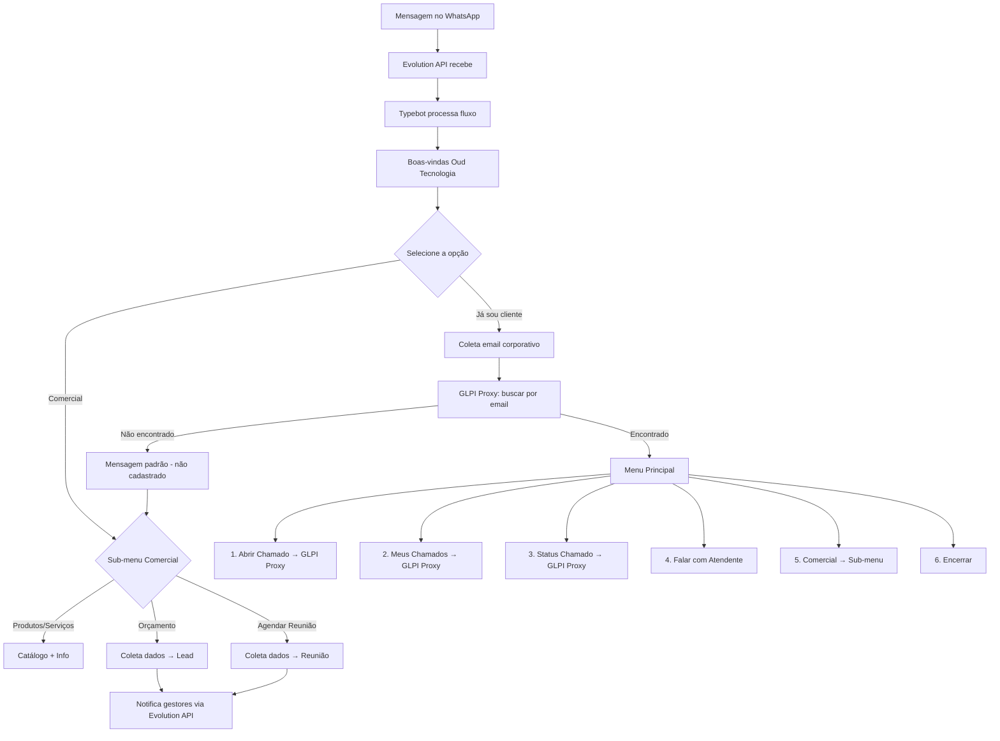

# Guia Completo — Integracao WhatsApp (Evolution API) + Typebot + GLPI

> **Documento unico e definitivo** — unifica deploy, fluxo do bot e operacao.
> Ultima atualizacao: 11/03/2026

---

## Indice

1. [Decisoes de Arquitetura](#1-decisoes-de-arquitetura)
2. [Arquitetura Final](#2-arquitetura-final)
3. [Arquivos do Projeto](#3-arquivos-do-projeto)
4. [Deploy — Passo a Passo (10 Fases)](#4-deploy)
5. [Fluxo do Bot — Visao Geral](#5-fluxo-do-bot)
6. [Fluxo do Bot — Detalhado](#6-fluxo-detalhado)
7. [Endpoints do GLPI Proxy](#7-endpoints-do-proxy)
8. [Variaveis do Typebot](#8-variaveis-typebot)
9. [Tratamento de Erros](#9-tratamento-de-erros)
10. [Runbook e Manutencao](#10-runbook)
11. [Checklist Final](#11-checklist)

---

## 1. Decisões de Arquitetura

Três decisões-chave definem esta stack:

### ✅ Evolution API em vez de UAZAPI

| | UAZAPI | Evolution API (escolhido) |
|---|---|---|
| Hospedagem | Nuvem (SaaS) — API já pronta | **Self-hosted (Docker)** — controle total |
| Integração Typebot | ❌ Sem integração nativa | **✅ Integração nativa** (`TYPEBOT_ENABLED=true`) |
| Listas WhatsApp | ✅ Suporta listas interativas | ❌ Não suporta mais (usar texto numerado) |
| Infra necessária | Nenhuma — só chamada HTTP | Postgres + Redis + Container (~300-500 MB) |
| Auth | Header `token` (instância) | Header `apikey` |
| Custo | Plano mensal (SaaS) | **Grátis** — open-source |

**Decisão:** A integração nativa Typebot ↔ WhatsApp é o coração do projeto. Sem ela, seria necessário construir um bridge de webhooks customizado (semanas de trabalho). A Evolution API entrega isso pronto. Listas interativas são substituídas por menus de texto numerados e reply buttons (máx 3 opções).

### ✅ Apache como proxy reverso (Nginx removido)

O GLPI já roda no Apache na porta 80 e **não será mexido**. Em vez de instalar Nginx e mudar a porta do Apache (causando downtime), adicionamos `mod_proxy` no Apache existente para rotear os novos subdomínios.

| | Abordagem Nginx (anterior) | Apache mod_proxy (escolhido) |
|---|---|---|
| Impacto no GLPI | ⚠️ ~2 min downtime + mudança de porta | **✅ Zero impacto** |
| Novo software | Nginx instalado | **Nenhum** — Apache já existe |
| Complexidade | 2 servidores web | **1 só** (Apache faz tudo) |
| SSL | Certbot + Nginx | Certbot + Apache |
| Rollback | Restaurar backup Apache | **Deletar VHost** e `a2dissite` |

### ✅ GLPI 100% intocado

O Apache continua na porta 80 servindo o GLPI exatamente como está. Apenas adicionamos VirtualHosts novos para os subdomínios (Typebot, Evolution, Proxy). Não alteramos nenhuma configuração existente.

---

## 2. Arquitetura Final

```
                            INTERNET
                                │
                     ┌──────────┴──────────┐
                     │   Apache (porta 80)  │  ← já existente, não mexemos
                     │   mod_proxy ativado  │
                     └──────────┬──────────┘
          ┌─────────────────────┼─────────────────────────┐
          │                     │                     │                     │
   glpi.dominio.com    typebot.dominio.com    bot.dominio.com    evolution.dominio.com
          │                     │                     │                     │
          ▼                     ▼                     ▼                     ▼
   /var/www/html/glpi    typebot_builder        typebot_viewer        evolution_api
   (como já funciona)    (127.0.0.1:3001)      (127.0.0.1:3002)      (127.0.0.1:8080)
                                │                     │                     │
                                └──────────┬──────────┘                     │
                                           │                                │
                                           ▼                                │
              ┌──────────────────────────────────────────────┐              │
              │  glpi_proxy (127.0.0.1:3003)                 │              │
              │  - Rate-limit & Helmet                       │              │
              │  - Fila persistente (Redis) + DLQ            │──────────────┘
              │  - Notifica gestores via Evolution API       │
              └──────────────────┬───────────────────────────┘
                                 │
                                 ▼
                     Apache/glpi/apirest.php
                     (localhost, mesma máquina)
```

### Mapa de Portas

| Serviço | Porta | Acessível externamente? |
|---|---|---|
| GLPI (Apache) | `80/443` | ✅ Sim (como já era) |
| MySQL (GLPI) | `127.0.0.1:3306` | Não |
| Evolution API | `127.0.0.1:8080` | Não (via Apache proxy) |
| Typebot Builder | `127.0.0.1:3001` | Não (via Apache proxy) |
| Typebot Viewer | `127.0.0.1:3002` | Não (via Apache proxy) |
| GLPI Proxy | `127.0.0.1:3003` | Não |
| Typebot Postgres | `127.0.0.1:5433` | Não |
| Evolution Postgres | `127.0.0.1:5434` | Não |
| Redis (proxy) | `127.0.0.1:6379` | Não |
| Redis (Evolution) | Interno Docker | Não |

### Redes Docker

| Rede | Propósito |
|---|---|
| `evolution_db_net` | Evolution API ↔ Evolution Postgres + Redis |
| `typebot_db_net` | Typebot Builder/Viewer ↔ Typebot Postgres |
| `internal_net` | GLPI Proxy ↔ Redis ↔ Typebot ↔ Evolution API |

---

## 3. Arquivos do Projeto

```
/opt/stack/
├── docker-compose.yml          ← 8 containers (Evolution + Typebot + Proxy + DBs + Redis)
├── .env                        ← variáveis de ambiente (chmod 600)
├── glpi-proxy/
│   ├── Dockerfile
│   ├── package.json
│   └── server.js               ← proxy (fila Redis, DLQ, auth, rate-limit, notificações)
├── apache/
│   ├── typebot-builder.conf    ← VHost: typebot.dominio.com → :3001
│   ├── typebot-viewer.conf     ← VHost: bot.dominio.com → :3002
│   └── evolution-api.conf      ← VHost: evolution.dominio.com → :8080
└── scripts/
    ├── backup.sh               ← backup Evolution DB + Typebot DB + Redis
    └── monitor.sh              ← monitoramento 8 containers + WhatsApp status
```

> Os arquivos `nginx/` **não são mais necessários**.

---

## 4. Deploy

### Diagnóstico da VPS

| Item | Valor |
|---|---|
| OS | Ubuntu 20.04.6 LTS |
| CPUs | 2 |
| RAM | 2.9 GB total / 2.3 GB disponível |
| Disco | 67 GB total / 52 GB livres |
| GLPI | `/var/www/html/glpi` — **Apache na porta 80 (não mexer!)** |
| Banco GLPI | MySQL `127.0.0.1:3306` |
| Docker/SSL/Firewall | ❌ Não instalados |

---

### FASE 1 — Instalar Docker `✅ Sem impacto no GLPI`

```bash
apt update && apt upgrade -y
curl -fsSL https://get.docker.com -o get-docker.sh && sh get-docker.sh
systemctl enable docker && systemctl start docker
docker --version && docker compose version
```

---

### FASE 2 — Enviar Arquivos e Gerar Senhas `✅ Sem impacto`

```bash
# No PC local (PowerShell)
scp -P 22009 -r .\docker-compose.yml .\glpi-proxy .\scripts .\apache .\.env.example \
  oud-1@103.204.193.6:/opt/stack/

# Na VPS — gerar 6 senhas
for i in $(seq 1 6); do echo "Senha $i: $(openssl rand -hex 32)"; done
```

Associar:
1. `POSTGRES_EVOLUTION_PASSWORD` (Evolution DB)
2. `POSTGRES_TYPEBOT_PASSWORD` (Typebot DB)
3. `AUTHENTICATION_API_KEY` (Evolution API auth)
4. `NEXTAUTH_SECRET` (Typebot)
5. `ENCRYPTION_SECRET` (Typebot)
6. `PROXY_SECRET` (GLPI Proxy)

```bash
cd /opt/stack && cp .env.example .env && nano .env
chmod 600 .env && chown root:root .env
```

---

### FASE 3 — Configurar Tokens no GLPI `✅ Sem impacto`

#### 3.1 — Habilitar API REST
`Configurar → Geral → API` → Ativar → Adicionar client "Bot WhatsApp" → copiar **App-Token**

#### 3.2 — Criar usuário dedicado
`Administração → Usuários → Adicionar`
- Login: `bot-whatsapp`, Perfil: apenas criar/ver tickets

#### 3.3 — Gerar User Token
Perfil do `bot-whatsapp` → `Chaves de acesso remoto → Regenerar` → copiar

#### 3.4 — Atualizar `.env`
```bash
nano /opt/stack/.env
# GLPI_APP_TOKEN=<token de 3.1>
# GLPI_USER_TOKEN=<token de 3.3>
```

---

### FASE 4 — Subir Containers `✅ Sem impacto`

```bash
cd /opt/stack && docker compose up -d
docker ps --format "table {{.Names}}\t{{.Status}}\t{{.Ports}}"
```

Resultado esperado (**8 containers**):

```
NAMES                STATUS              PORTS
evolution_api        Up (healthy)        127.0.0.1:8080->8080/tcp
evolution_postgres   Up (healthy)
evolution_redis      Up (healthy)
typebot_builder      Up (healthy)        127.0.0.1:3001->3000/tcp
typebot_viewer       Up (healthy)        127.0.0.1:3002->3000/tcp
typebot_postgres     Up (healthy)
glpi_proxy           Up (healthy)        127.0.0.1:3003->3003/tcp
proxy_redis          Up (healthy)
```

**GLPI continua funcionando normalmente** — nada mudou nele:
```bash
curl -s http://localhost/glpi/ | head -5
```

---

### FASE 5 — VirtualHosts no Apache `✅ Sem impacto no GLPI`

> **Nenhum downtime!** Apenas adicionamos VHosts novos sem tocar nos existentes.

#### 5.1 — Habilitar mod_proxy
```bash
a2enmod proxy proxy_http proxy_wstunnel headers rewrite
```

#### 5.2 — Copiar VHosts e configurar domínio

```bash
# Copiar os 3 VHosts
cp /opt/stack/apache/*.conf /etc/apache2/sites-available/

# Trocar placeholder pelo domínio real
sed -i 's/SEUDOMINIO.com.br/seudominio.com/g' \
  /etc/apache2/sites-available/typebot-builder.conf \
  /etc/apache2/sites-available/typebot-viewer.conf \
  /etc/apache2/sites-available/evolution-api.conf

# Ativar sites
a2ensite typebot-builder.conf typebot-viewer.conf evolution-api.conf

# Testar — NÃO reinicie sem testar!
apachectl configtest
# Se "Syntax OK" → aplicar:
systemctl reload apache2
```

#### 5.3 — Verificar que GLPI não foi afetado
```bash
curl -s http://localhost/glpi/ | head -5
# Se retorna HTML do GLPI → tudo certo, nada quebrou
```

> **Rollback se precisar:** `a2dissite typebot-builder typebot-viewer evolution-api && systemctl reload apache2`

---

### FASE 6 — DNS `✅ Sem impacto`

Criar registros A no provedor DNS:

| Subdomínio | Valor |
|---|---|
| `typebot.seudominio.com` | IP da VPS |
| `bot.seudominio.com` | IP da VPS |
| `evolution.seudominio.com` | IP da VPS |

```bash
dig typebot.seudominio.com +short      # deve retornar o IP
dig evolution.seudominio.com +short    # deve retornar o IP
```

---

### FASE 7 — SSL `✅ Sem impacto`

```bash
apt install -y certbot python3-certbot-apache

certbot --apache \
  -d typebot.seudominio.com \
  -d bot.seudominio.com \
  -d evolution.seudominio.com \
  --email admin@seudominio.com --agree-tos --no-eff-email

# Verificar renovação automática
certbot renew --dry-run
```

> Se o GLPI já tem SSL configurado, não precisa mexer. Se não tem e quiser adicionar:
> `certbot --apache -d glpi.seudominio.com`

---

### FASE 8 — Configurar Evolution API + WhatsApp `✅ Sem impacto`

#### 8.1 — Acessar painel Evolution
Acesse `https://evolution.seudominio.com` no navegador.
Use a `AUTHENTICATION_API_KEY` do `.env` para autenticar via header `apikey`.

#### 8.2 — Criar instância e conectar WhatsApp
```bash
# Criar instância (da VPS ou PC)
curl -s -X POST "https://evolution.seudominio.com/instance/create" \
  -H "apikey: SUA_AUTHENTICATION_API_KEY" \
  -H "Content-Type: application/json" \
  -d '{"instanceName":"glpi-bot","integration":"WHATSAPP-BAILEYS"}'
```

#### 8.3 — Conectar via QR Code
```bash
# Gerar QR Code
curl -s "https://evolution.seudominio.com/instance/connect/glpi-bot" \
  -H "apikey: SUA_AUTHENTICATION_API_KEY"
```
Escaneie o QR Code com o número **dedicado** do bot.

#### 8.4 — Verificar conexão
```bash
curl -s "https://evolution.seudominio.com/instance/connectionState/glpi-bot" \
  -H "apikey: SUA_AUTHENTICATION_API_KEY"
# Esperado: {"instance":{"state":"open"}}
```

#### 8.5 — Configurar integração Typebot
```bash
curl -s -X POST "https://evolution.seudominio.com/typebot/set/glpi-bot" \
  -H "apikey: SUA_AUTHENTICATION_API_KEY" \
  -H "Content-Type: application/json" \
  -d '{
    "enabled": true,
    "url": "https://bot.seudominio.com",
    "typebot": "ID_DO_SEU_TYPEBOT",
    "triggerType": "all"
  }'
```

> **Importante:** O `ID_DO_SEU_TYPEBOT` é visível na URL quando você edita o bot no Typebot Builder.

---

### FASE 9 — Criar Fluxo no Typebot `✅ Sem impacto`

1. Acessar `https://typebot.seudominio.com`
2. Login com o `ADMIN_EMAIL` do `.env`
3. Criar bot seguindo o [Fluxo Detalhado (seção 6)](#6-fluxo-detalhado)
4. **Publicar** o fluxo
5. Anotar o **ID público** (visível na URL)
6. Atualizar o ID na integração Evolution (FASE 8.5)

---

### FASE 10 — Backup, Monitoramento e Firewall `✅ Sem impacto`

```bash
# Scripts executáveis
chmod +x /opt/stack/scripts/backup.sh /opt/stack/scripts/monitor.sh

# Backup automático às 3h (Evolution DB + Typebot DB + Redis)
echo "0 3 * * * root /opt/stack/scripts/backup.sh >> /var/log/stack-backup.log 2>&1" \
  > /etc/cron.d/stack-backup

# Monitor a cada 3 min (8 containers, disco, RAM, WhatsApp)
echo "*/3 * * * * root /opt/stack/scripts/monitor.sh >> /var/log/stack-monitor.log 2>&1" \
  > /etc/cron.d/stack-monitor

mkdir -p /opt/backups

# Firewall
apt install -y ufw
ufw allow 22/tcp && ufw allow 80/tcp && ufw allow 443/tcp
ufw --force enable
```

---

## 5. Fluxo do Bot



**Caminho dos dados:**
```
WhatsApp → Evolution API (VPS:8080) → Typebot Viewer (VPS:3002) → GLPI Proxy (VPS:3003) → GLPI API (localhost)
```

---

## 6. Fluxo Detalhado

### ETAPA 0 — Triagem Inicial

```
BOT: "Olá! 👋 Somos da Oud Tecnologia.
      Selecione uma das opções abaixo para continuarmos:"

BOTÕES (reply buttons — máx 3):
[ Já sou cliente ]  → ETAPA 1
[ Comercial ]       → FLUXO COMERCIAL
```

---

### ETAPA 1 — Identificação do Cliente

```
BOT: "Excelente! Para agilizarmos seu atendimento, preciso te identificar.
      Por favor, informe seu email corporativo:"

USUÁRIO: digita → salvar em {{email_identificacao}}
```

**Validação:** Regex de email (contém @ e domínio). Máx 3 tentativas.

---

### ETAPA 2 — Buscar Usuário no GLPI

**HTTP Request no Typebot:**
```
URL:     http://glpi-proxy:3003/user/search
Método:  POST
Headers:
  Content-Type: application/json
  x-proxy-key: {{proxy_secret}}
Body:    { "email": "{{email_identificacao}}" }
Salvar em: {{usuario_glpi}}
```

| Resultado | Ação |
|---|---|
| `found == true` | Salvar `{{user_id}}`, `{{user_name}}` → **Menu Principal** |
| `found == false` | → **Mensagem Padrão (não cadastrado)** |

---

### ETAPA 3 — Mensagem Padrão (Não Cadastrado)

```
BOT: "Não encontramos seu cadastro no sistema. 😕
      Para ter acesso ao suporte técnico, solicite ao gestor
      do seu projeto que cadastre seu email no GLPI.

      Enquanto isso, posso te ajudar com nosso setor Comercial!"
```

→ Redireciona para **FLUXO COMERCIAL**

> **Importante:** NÃO é permitido criar usuários via WhatsApp.
> O cadastro deve ser feito pelo gestor do projeto diretamente no GLPI.

---

### ETAPA 4 — Menu Principal

```
BOT: "Olá {{user_name}}! Como posso ajudar?
      
      1️⃣ 📝 Abrir um chamado
      2️⃣ 📋 Ver meus chamados
      3️⃣ 🔍 Consultar status de um chamado
      4️⃣ 💬 Falar com um atendente
      5️⃣ 🏢 Comercial
      6️⃣ ❌ Encerrar"
```

---

### OPÇÃO 1 — Abrir Chamado

**Passo a passo:**
1. **Tipo:** Incidente (1) ou Solicitação (2)
2. **Categoria:** Botões dinâmicos (IDs do GLPI — ver `Configurar → Categorias ITIL`)
3. **Urgência:** 🔴 Alta (2) / 🟡 Média (3) / 🟢 Baixa (4)
4. **Título:** mín 5 caracteres
5. **Descrição:** mín 10 caracteres
6. **Confirmação:** Resumo + Confirmar/Cancelar

```
URL:     http://glpi-proxy:3003/ticket
Método:  POST
Body:
{
  "nome": "{{titulo_chamado}}",
  "descricao": "{{descricao_chamado}}",
  "tipo": {{tipo_chamado}},
  "urgencia": {{urgencia}},
  "categoria_id": {{categoria_id}},
  "user_id": {{user_id}},
  "telefone": "{{telefone_whatsapp}}"
}
```

| Resultado | Resposta |
|---|---|
| Sucesso | "✅ Chamado #XXX aberto!" |
| Queued (GLPI offline) | "⚠️ Salvo na fila segura, será criado automaticamente" |
| Erro | "❌ Erro. Tente novamente ou contate TI" |

**Resiliência:** Se GLPI não responde, o proxy salva no Redis e tenta recriar a cada 1 min. Após 5 falhas → Dead Letter Queue (recuperação manual).

---

### OPÇÃO 2 — Ver Meus Chamados

```
GET http://glpi-proxy:3003/user/{{user_id}}/tickets
```

Exibe os 5 mais recentes: ID, título, status (com emoji), data.

| Código | Status | Emoji |
|---|---|---|
| 1 | Novo | 🆕 |
| 2 | Em atendimento | 🔄 |
| 3 | Planejado | 📅 |
| 4 | Pendente | ⏸️ |
| 5 | Solucionado | ✅ |
| 6 | Fechado | 🔒 |

---

### OPÇÃO 3 — Consultar Status

```
BOT: "Informe o número do chamado (ex: 123):"
GET http://glpi-proxy:3003/ticket/{{ticket_id_consulta}}
```

Exibe: título, status, urgência, data de abertura.

---

### FLUXO COMERCIAL

```
BOT: "Nosso setor Comercial pode ajudar com:

      1️⃣ 📦 Conhecer nossos produtos/serviços
      2️⃣ 💰 Solicitar orçamento
      3️⃣ 📅 Agendar uma reunião"
```

#### Opção 1 — Produtos/Serviços
```
BOT: "Conheça nossos principais serviços:

      1️⃣ Suporte e Gestão GLPI
      2️⃣ Infraestrutura Cloud
      3️⃣ Desenvolvimento sob demanda
      4️⃣ Consultoria em TI

      Qual área te interessa?"

USUÁRIO: escolhe → salvar em {{produto_selecionado}}

BOT: "[Descrição do serviço escolhido]
      
      Quer solicitar um orçamento para este serviço?"

BOTÕES: [ Sim → Orçamento ] [ Não → Menu anterior ]
```

#### Opção 2 — Solicitar Orçamento
```
BOT: "Vou coletar algumas informações para nosso time comercial:"

Coleta:
- {{lead_nome}}     → "Seu nome completo:"
- {{lead_empresa}}  → "Nome da empresa:"
- {{lead_email}}    → "Email para contato:"
- {{lead_telefone}} → "Telefone:"
- {{lead_servico}}  → "Qual serviço te interessa?" (botões)
- {{lead_detalhes}} → "Detalhes adicionais sobre sua necessidade:"
```

**HTTP Request:**
```
URL:     http://glpi-proxy:3003/comercial/lead
Método:  POST
Body:
{
  "tipo": "orcamento",
  "nome": "{{lead_nome}}",
  "empresa": "{{lead_empresa}}",
  "email": "{{lead_email}}",
  "telefone": "{{lead_telefone}}",
  "servico": "{{lead_servico}}",
  "detalhes": "{{lead_detalhes}}",
  "whatsapp": "{{telefone_whatsapp}}"
}
```

```
BOT: "✅ Recebemos sua solicitação!
      Nosso time comercial entrará em contato em até 24h úteis.
      Protocolo: {{lead_resposta.id}}"
```

> **Backend:** O proxy salva o lead no Redis (`comercial:leads`) e
> envia WhatsApp para os gestores via Evolution API automaticamente.

#### Opção 3 — Agendar Reunião
```
Coleta:
- {{reun_nome}}     → "Seu nome:"
- {{reun_empresa}}  → "Empresa:"
- {{reun_email}}    → "Email:"
- {{reun_telefone}} → "Telefone:"
- {{reun_data}}     → "Preferência de data (ex: próxima semana):"
- {{reun_horario}}  → "Horário preferido:" (botões: Manhã/Tarde)
- {{reun_assunto}}  → "Sobre o que gostaria de conversar?"
```

**HTTP Request:** mesmo endpoint `/comercial/lead` com `"tipo": "reuniao"`.

```
BOT: "✅ Solicitação de reunião registrada!
      Entraremos em contato para confirmar data e horário.
      Protocolo: {{reun_resposta.id}}"
```

---

### OPÇÃO 4 — Falar com Atendente

```
BOT: "Vou encaminhar você para um atendente humano.
      Qual o motivo do contato?"

USUÁRIO: digita → salvar em {{motivo_suporte}}
```

NOTIFICAÇÃO (via Evolution API):
Enviar dados para o grupo de Suporte/TI com link para o usuário no WhatsApp.

```
BOT: "✅ Um atendente foi notificado e entrará em contato em breve.
      Horário de atendimento: Seg-Sex, 08h às 18h."
```

---

### OPÇÃO 5 — Comercial (do Menu Principal)

Redireciona para o **FLUXO COMERCIAL** acima.

---

### OPÇÃO 6 — Encerrar

```
BOT: "Obrigado por usar o atendimento da Oud Tecnologia! 👋
      Se precisar de algo, é só mandar uma mensagem."
```

---

## 7. Endpoints do Proxy

| Método | Endpoint | Função |
|---|---|---|
| `POST` | `/ticket` | Criar chamado |
| `GET` | `/ticket/:id` | Consultar chamado |
| `POST` | `/user/search` | Buscar usuário por **email** |
| `GET` | `/user/:id/tickets` | Listar tickets do usuário |
| `POST` | `/comercial/lead` | Salvar lead + notificar gestores |
| `GET` | `/health` | Health check (status, fila, DLQ) |

**Segurança:** Rate-limit 120 req/min + Helmet + `x-proxy-key` auth + Fila Redis + DLQ.

> **REMOVIDO:** `POST /user/create` — Não é permitido criar usuários via WhatsApp.

---

## 8. Variáveis Typebot

### Identificação

| Variável | Tipo | Origem |
|---|---|---|
| `{{email_identificacao}}` | string | Input do usuário (email corporativo) |
| `{{usuario_glpi}}` | object | Resposta de `POST /user/search` |
| `{{user_id}}` | number | Extraído de `usuario_glpi` |
| `{{user_name}}` | string | Extraído de `usuario_glpi` |
| `{{user_email}}` | string | Extraído de `usuario_glpi` |

### Chamados

| Variável | Tipo | Origem |
|---|---|---|
| `{{tipo_chamado}}` | number | 1=Incidente, 2=Solicitação |
| `{{categoria_id}}` | number | ID da categoria ITIL no GLPI |
| `{{urgencia}}` | number | 2=Alta, 3=Média, 4=Baixa |
| `{{titulo_chamado}}` | string | Input do usuário |
| `{{descricao_chamado}}` | string | Input do usuário |
| `{{resposta_ticket}}` | object | Resposta de `POST /ticket` |
| `{{meus_tickets}}` | array | Resposta de `GET /user/:id/tickets` |
| `{{ticket_info}}` | object | Resposta de `GET /ticket/:id` |
| `{{ticket_id_consulta}}` | string | Input do usuário |

### Comercial — Orçamento

| Variável | Tipo | Origem |
|---|---|---|
| `{{lead_nome}}` | string | Input do usuário |
| `{{lead_empresa}}` | string | Input do usuário |
| `{{lead_email}}` | string | Input do usuário |
| `{{lead_telefone}}` | string | Input do usuário |
| `{{lead_servico}}` | string | Escolha do usuário |
| `{{lead_detalhes}}` | string | Input do usuário |
| `{{lead_resposta}}` | object | Resposta de `POST /comercial/lead` |

### Comercial — Reunião

| Variável | Tipo | Origem |
|---|---|---|
| `{{reun_nome}}` | string | Input do usuário |
| `{{reun_empresa}}` | string | Input do usuário |
| `{{reun_email}}` | string | Input do usuário |
| `{{reun_telefone}}` | string | Input do usuário |
| `{{reun_data}}` | string | Escolha do usuário |
| `{{reun_horario}}` | string | Escolha do usuário |
| `{{reun_assunto}}` | string | Input do usuário |
| `{{reun_resposta}}` | object | Resposta de `POST /comercial/lead` |

### Sistema

| Variável | Tipo | Origem |
|---|---|---|
| `{{proxy_secret}}` | string | Variável oculta no Typebot |
| `{{produto_selecionado}}` | string | Escolha do usuário (produtos) |
| `{{motivo_suporte}}` | string | Input do usuário (falar com atendente) |

> **Nota sobre menus:** Como a Evolution API não suporta mais listas interativas
> do WhatsApp, todos os menus com mais de 3 opções usam **texto numerado**
> ("digite 1, 2, 3..."). Para menus com até 3 opções, use **reply buttons**.

---

## 9. Tratamento de Erros

| Situação | Comportamento |
|---|---|
| Email inválido | Pede novamente, máx 3x → encerra |
| Usuário não encontrado no GLPI | Mensagem padrão (não cadastrado) → só mostra Comercial |
| GLPI offline (criar ticket) | Fila Redis, retry automático |
| GLPI offline (consultar) | Mensagem de indisponibilidade |
| Ticket não encontrado | Informa e pede verificar número |
| Timeout 30 min | Fluxo encerra, próxima msg reinicia |
| Input inesperado | "Não entendi" + repetir a pergunta |
| Erro ao salvar lead comercial | Mensagem de erro + contato alternativo |
| Evolution API fora do ar | Mensagens não chegam — verificar container e painel |
| Erro 500 | Mensagem genérica + contato humano |

---

## 10. Runbook

### Manutenção Periódica

| Ação | Frequência | Comando |
|---|---|---|
| Verificar logs | Diário | `tail -20 /var/log/stack-monitor.log` |
| Verificar backups | Semanal | `ls -lh /opt/backups/` |
| Atualizar imagens Docker | Mensal | `cd /opt/stack && docker compose pull && docker compose up -d` |
| Renovar SSL | Automático | `certbot renew --dry-run` |
| Limpar Docker | Mensal | `docker system prune -f` |
| Verificar disco | Semanal | `df -h /` |
| Status WhatsApp | Semanal | `curl localhost:8080/instance/connectionState/glpi-bot -H "apikey: KEY"` |

### Resolução de Problemas

| Problema | Solução |
|---|---|
| GLPI fora do ar | `systemctl restart apache2` |
| WhatsApp desconectou | Acessar `evolution.dominio.com` → Reconectar instância |
| Container não sobe | `docker logs CONTAINER --tail 50` → verificar `.env` |
| Tickets não criam | `curl localhost:3003/health` → ver tokens GLPI |
| Disco cheio | `docker system prune -f` + limpar backups antigos |
| RAM esgotada | `docker stats --no-stream` → reiniciar container pesado |
| Rate Limit (429) | Aguardar 1 min ou ajustar em `server.js` |
| Apache 502 no Typebot | Container caiu → `docker compose restart typebot_builder` |
| Evolution não envia | `docker logs evolution_api --tail 50` → verificar apikey |
| Bot não responde | Verificar: Evolution connected → Typebot published → Proxy healthy |

### Rollback Completo

```bash
# Parar containers
cd /opt/stack && docker compose down

# Remover VHosts novos (GLPI não é afetado)
a2dissite typebot-builder typebot-viewer evolution-api
systemctl reload apache2

# GLPI continua 100% funcional — nunca foi mexido
```

---

## 11. Checklist

- [ ] Docker instalado e funcionando
- [ ] `.env` preenchido com 6 senhas + tokens GLPI
- [ ] API REST do GLPI habilitada com App-Token
- [ ] Usuário `bot-whatsapp` no GLPI com permissão mínima
- [ ] **8 containers** `Up (healthy)` (evolution_api, evolution_postgres, evolution_redis, builder, viewer, typebot_postgres, glpi_proxy, proxy_redis)
- [ ] **Apache intacto na porta 80** — GLPI acessível normalmente
- [ ] VHosts para `typebot.`, `bot.` e `evolution.` ativados e funcionando
- [ ] DNS dos 3 subdomínios propagado
- [ ] SSL válido nos 3 subdomínios
- [ ] Instância Evolution API criada (`glpi-bot`)
- [ ] WhatsApp conectado na Evolution (state: "open")
- [ ] Integração Evolution → Typebot configurada (`typebot/set`)
- [ ] Fluxo Typebot publicado
- [ ] Mensagem no WhatsApp → fluxo → ticket no GLPI ✅
- [ ] Backup automático configurado (cron 3h — Evolution DB + Typebot DB)
- [ ] Monitoramento configurado (cron 3 min — 8 containers)
- [ ] Firewall UFW ativo (22, 80, 443)
- [ ] `.env` com `chmod 600`

---

## Teste Final Ponta a Ponta

```bash
echo "═══ 1. GLPI acessível? ═══"
curl -s -o /dev/null -w "%{http_code}" http://localhost/glpi/
# Esperado: 200 ou 302

echo "═══ 2. Containers saudáveis? ═══"
docker ps --format "table {{.Names}}\t{{.Status}}" | grep -c "healthy"
# Esperado: 8

echo "═══ 3. GLPI Proxy conectado? ═══"
curl -s http://localhost:3003/health

echo "═══ 4. Evolution API conectada? ═══"
curl -s http://localhost:8080/instance/connectionState/glpi-bot \
  -H "apikey: SUA_KEY"
# Esperado: {"instance":{"state":"open"}}

echo "═══ 5. SSL válido? ═══"
curl -s -o /dev/null -w "%{http_code}" https://typebot.seudominio.com/
curl -s -o /dev/null -w "%{http_code}" https://bot.seudominio.com/
curl -s -o /dev/null -w "%{http_code}" https://evolution.seudominio.com/
```

**Teste manual:**
1. Envie "oi" para o número do bot no WhatsApp
2. Siga o fluxo até criar um chamado
3. Verifique no painel do GLPI se o ticket apareceu ✅
